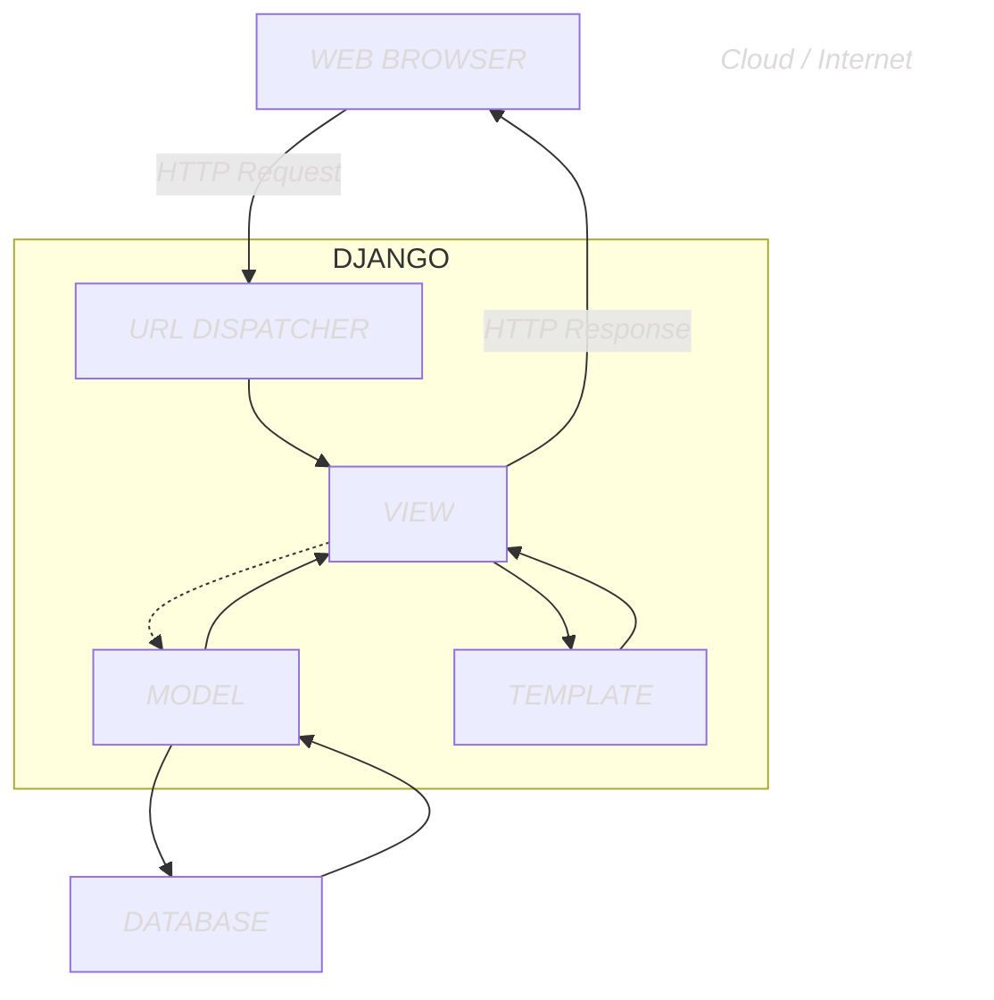

# Chapter 2: Hello!

We cover how websites and "web frameworks" work, examine Django architecture, and build a simple Django hello greeting. Will see our first part about URL mappers and views.

## How accessing a website works.

When you access a website, these actions take place:

1. You enter a domain name into a browser 
2. The browser looks up the IP address for the domain name via *DNS* (*Domain Name System*) 
3. The browser establishes a network connection to the web server 4. The browser sends an *HTTP request* for the desired resource (e.g., the homepage) 
5. The website processes the request (more on this below) and returns an *HTTP response* 
6. The browser begins rendering the *webpage* 

## How a web framework works

There are two categories of websites. Static and dynamic. It is what it sounds like.

A static website consists of individual HTML files. If you had ten webpages on your website, you are going to need ten HTML files. This isn't bad or anything. Many basic websites for small things, such as older software downloads (you've likely seen this), old blogs, etc, use this. But it only works well for smaller sites. It quickly gets tedious, repetitive, slow, and unsafe at some point.

Then there is dynamic. This is what most modern websites are. Behind the scenes, these websites consists of databases, HTML templates, and an application server that can pack, generate, and translate the template rules and HTML files to something browsers understand (normal HTML). With a dynamic website you can generate hundreds or even thousands of webpages with extordinarily less lines of code than having an individual HTML file.

Django is the framework to manage the databases and templates. It isn't though, what can serve the user, other relatively simple separate applications are used for that. But it is mostly doing the heavy lifting.

At its core, Django performs three main tasks:

1. Map URLs to view logic for rendering pages
2. Provide utility to interact with a database
3. Display HTML-like code via a template system

There are probably thousands of web frameworks. In all different programming languages. Some do more or less and meet different needs, like some are for ultra secure tasks, where security, safety, and speed are needed. For example, `Flask (python)` and `Express (Node.js)` are very minimal. They do not care how you organize files, etc. They are from the ground up. They only do what you tell them. In the middle is frameworks like `Next.js (react)` (probably the most used one) and `FastAPI (python)`. They can do routing and server requests out of the box, but need help with interacting with databases. And finally are more heavy/all in one frameworks like `Django (python)` (what were doing!!!) and `Ruby on Rails (ruby)`. Ruby is probably one of the most influential. It was an earlier framework that really took off and set the standards. It still has major use, and has a... *reputation*.

## Django Architecture

There are four main components of DJango: URLs, views, models, and templates.




When an HTTP Request come in from a web browser, the first part that Django it (the HTTP Request) interacts with is the URL Dispatcher, that is the `urls.py` file. It searches through configured URL patterns and stops at the **first matching** view (the `views.py` file). The view assembles the requested data and styling before generating an HTTP Response back to the web browser. This is technically all you need. It is possible to just have a Django framework website with a URL Dispatcher and a View. **This is part of chapter 2 files**.

However it is more common to have two more specific components involved. Model and Template. For a database-backed website, the View will then interact with the Model (the `models.py` file), which defines database tables, behavior, and supports queries from the Database. That data is then sent back to the View, which in most cases sends it to the Template for rendering. The Template is primarily an HTML file but it can be any text based format. Including `XML` and `JSON`. Common files that websites use. Once the view has all the necessary info, it returns an HTTP Response to the web browser.

This Django request/response cycle repeats for each new HTTP Request made by a browser. It sounds like a lot, but happens extremely quickly. Like, 200ms, likely less, depending on what is being Requested.

## The Model-View-Controller vs Model-View-Template system.

Some of the previous mentioned frameworks use different methods of serving content. Rails, Spring, Laravel, and .NET use MVC. This is the way they internally separate an applications data and logic and display:

1. Model: Manages data and core business logic
2. View: Renders data from model in a certain format
3. Controller: Accepts user input and performs application-specific logic

Django and some others use MVT:

1. Model: Manages data and core business logic
2. View: Describes *which* data is sent to the user but **not its presentation**
3. Template: Presents the data as HTML with optional CSS, JavaScript, and static assets
4. URL Configuration: `Regex` components configured to a View

## Initial setup

Make a folder called helloworld (or chapter 2), create a env, install Django, and create project.

You should have:
```bash
*(chapter)*
├── django_project
│   ├── asgi.py
│   ├── __init__.py
│   ├── settings.py
│   ├── urls.py
│   └── wsgi.py
└── manage.py
```
Django will create the above files and folder. Lets break it down:

* `django_project`
   
    * `asgi.py` Configures an optional ASGI application. Not needed for a while. 
    * `__init__.py` Indicates that the files in the folder are part of a Python package. Without it, we cannot import files from another directory. We need that functionality, it is **foundational** to Django and python web frameworks in general. We will see an example in this chapter
    * `settings.py`  Controls Django project's overall settings.
    * `urls.py` Tells Django which pages to build in *response* to a browser or URL Request 
    * `wsgi` Configures a WSGI application. The default settings for Django. 
* `manage.py` Execute Django, such as starting local development server access.

Start the server and make sure it works.

When you start the server for the first time it will create an db.sqlite3 file. This is your SQLite database. You will see an error in the terminal related to this.

These errors/warnings are about migrations. Migrations are specials scripts that Django creates automatically to track changes to the changes to the database. As the project grows over time there are many changes to the Django database models that define the structure of a database and all of its tables. The Django migrations framework allows devs to track changes over time and change the database to match teh configurations within a specific migrations file. It is quite literally version control, like git.

When you start a new project using the startup project command, Django includes built-in apps that make changes to the database. We can apply these changes to the local database using the management command `migrate`.

Run the migration command, then start the server again.

## Creating an app.

Now it gets fun.

Django project contains many 'apps'. And organized technique for keeping code clean and readable. Each app should control an isolated piece of functionality. Django comes with 6 default apps. They control basic functionality like the admin panel, and authentication. Do not worry about what they all do.

There is no required app writing convention. You could write all your cod ein a single file. But the convention of separating different functionalities/goals in different app files makes it easier to structure and reason about a project. If you had a commerce site for auth, payments, and item listing details, you really do not want that in one single app. 

If a single app feels like it is doing too much, it is time to *split features* into *separate* apps with a single function.

To create a new app, go to the command line and use the startapp command followed by app name. This app name should be what it is about.

Now, you will see Django has created a new folder for the app in the root project (venv) directory. It is similar to the default root folder

* `admin.py` config file for built in Admin app.
* `app.py` is a config file for the app itself
* `migrations/ folder` keeps track of any changes to our models.py file so it stays in sync with database
* `models.py` is where we define our database models, which Django translates into database tables
* `tests.py` is for app tests 
* `views.py` Handles request/response logic for app. Very important

We created the app within the project, but Django has no idea it exists. We should go back to the Django `settings.py` file. In the `INSTALLED_APPS` list, add our app as `"pages",`. You should make comments for what you added.

## View logic

Now we need to add the view object, a simple greeting. No styling. No database, no template.

A view is a python function that accepts a web Request and returns a Web Response. The web response really could be anything you want to send back. Inside the pages app, there will be a view.py file. For now we do not need the default render module. Remove it and add the django http response modules.

Then create a function called `home_page_view` that uses request. Have it `return` using HttpResponse object a simple greeting phrase.

## URL Dispatcher

With our view made, its time to configure a URL for it. You need to create a new file called `urls.py` inside the app you made, and build it like this:

```python
# pages/urls.py
from django.urls import path  # import

# referring to views.py with from.views, thats how we get it here. home_page_view is part of that.
from .views import home_page_view

# There are two things going on here. The route is defined by empty string.
# Then a reference to the view home_page_view
urlpatterns = [path("", home_page_view)]
```

URL pattern has to parts. The route itself, defined by an empty string `""`. And a reference to the view home_page_view function. So, in other words, if the user quests the homepage represented by empty string, Django should use the view called home_page_view.

Almost done.

Last step is to update the `urls.py` file in the `django_project` folder. This is the gateway to other URL patterns that distinct each app from each other. This architecture will make more sense as we build.

Django automatically imports and sets a path for the built in admin. To include an additional URL path, we import the function `include` from the `django.urls` module. **This is important**. We again use the empty string, and include all URls contained in the pages app.

```python
urlpatterns = [
    ...,
    path("", include("pages.urls")),
]
```

The empty string represents our homepage. Because there is nothing in it, quite literal.

Start server, you should see the greeting.

###  Good job.